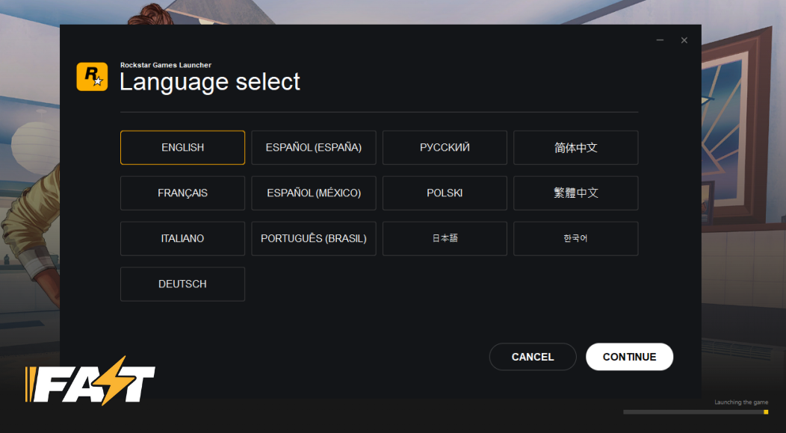
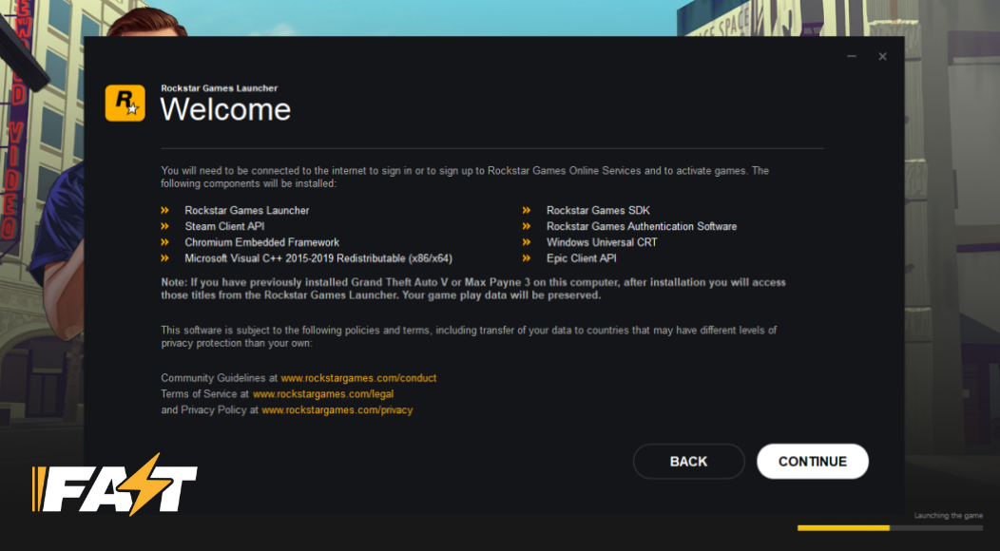
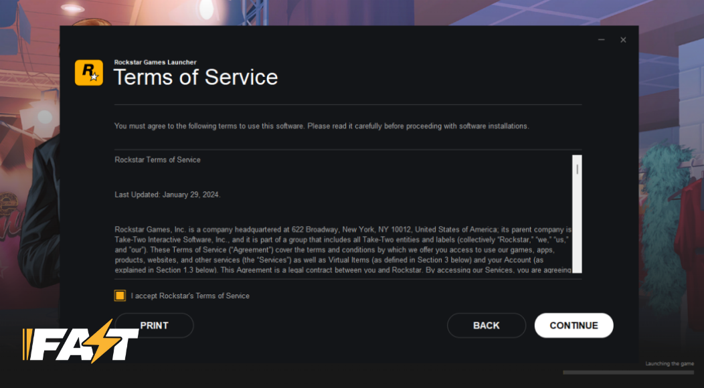
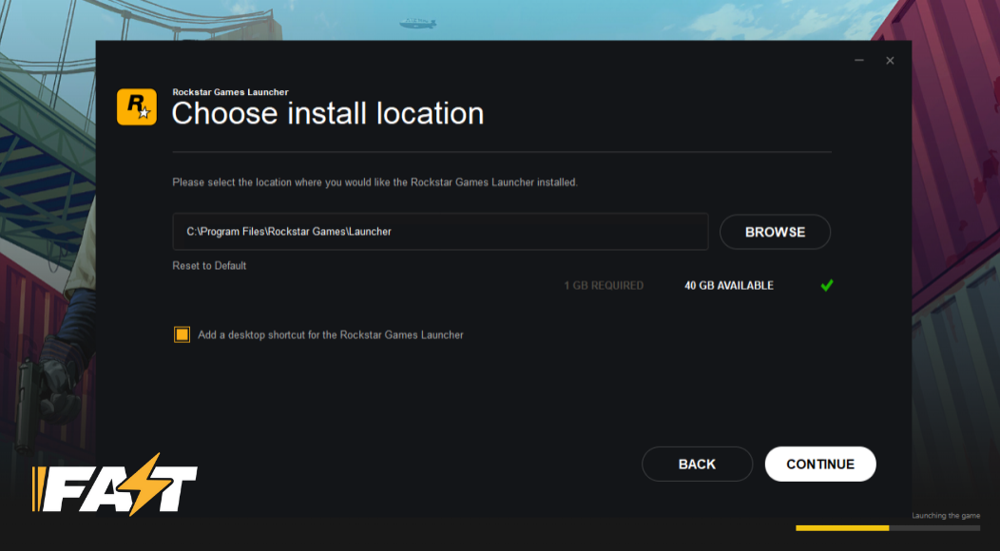
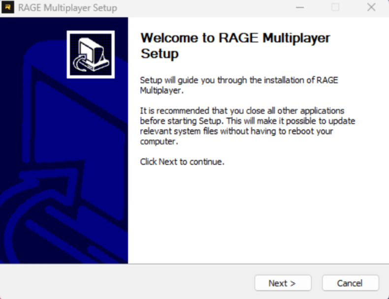
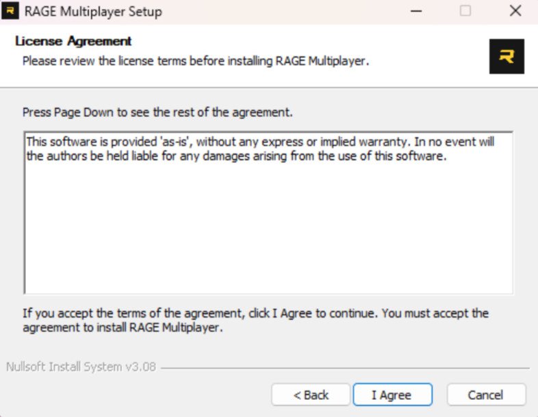
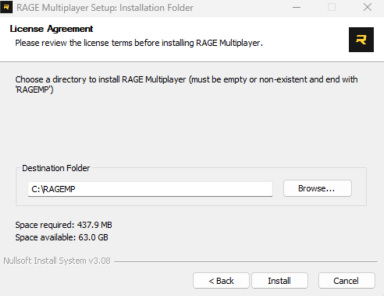
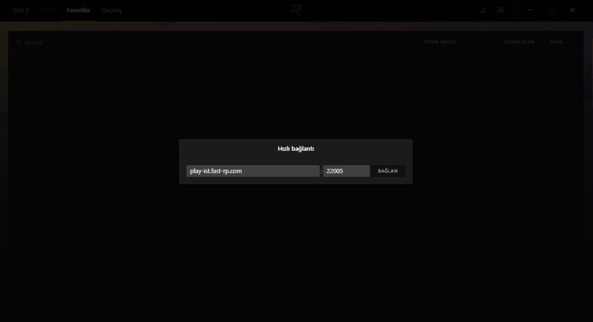

# Oyun Kurulumu 

## 📑 İçerik

| Bağlantılar | Açıklama |
|-------|----------|
| [GTA:V Kurulumu](#gta:v-kurulumu) | Buradan nasıl GTA:V kurulumu yapabileceğinizi görüntüleyebilirsiniz. |
| [RageMP Kurulumu](#ragemp-kurulumu) | Buradan RageMP kurulumunu görüntüleyebilirsiniz.  |
| [Son Adım](#son-adim) | RageMP üzerinden sunucuya nasıl giriş yapabileceğinizi görüntüleyebilirsiniz. |

## GTA:V Kurulumu

Kurulum için lisanslı bir GTA:V'e sahip olmalısınız. Mevcut bir GTA:V hesabınız var ise bu adımı atlayabilirsiniz.
Lisanslı GTA:V'yi [Epic Games](https://store.epicgames.com/tr/p/grand-theft-auto-v), [Steam](https://store.steampowered.com/app/3240220/Grand_Theft_Auto_V_Enhanced/) veya [Rockstar Games](https://store.rockstargames.com/game/buy-gta-v?utm_source=chatgpt.com) üzerinden satın alabilirsiniz.
Satın aldıktan sonra yükleyin ve bir sonraki aşamaya geçin.

## Rockstar Games Kurulumu
1. Yüklenen GTA:V'yi çalıştırın.
    1.1 Karşınıza gelen Language Select ekranından "English" seçeneğini seçip devam edin.

2. Açılan pencereden "Continue" butonuna tıklayarak devam edin.

3. Şartları okuyun ve sol aşağıdaki butonu tikleyin ve bir sonraki aşamaya geçin.

4. Kurulum lokasyonu seçin. Varsayılan olarak kullanmanız tavsiye edilir.

5. Açılan pencereyi kapatarak kurulumu tamamlayın.
---

## RageMP kurulumu
1. Linke tıklayarak RageMP'yi yükleyin.
[RAGE Multiplayer İndir](https://rage.mp)
2. Açılan pencereden devam edin.

3. Lisans anlaşmasını okuyup kabul edin.

4. Kurulum için hedef dosyayı seçin ve kurulumu tamamlayın.

---
## Son Adım
* Sağ üstte bulunan "Hızlı Bağlantı" butonuna tıklayarak açın. Ardından aşağıdaki IP'yi girip Fast'in tadını çıkarın.
`play-ist.fast-rp.com`

